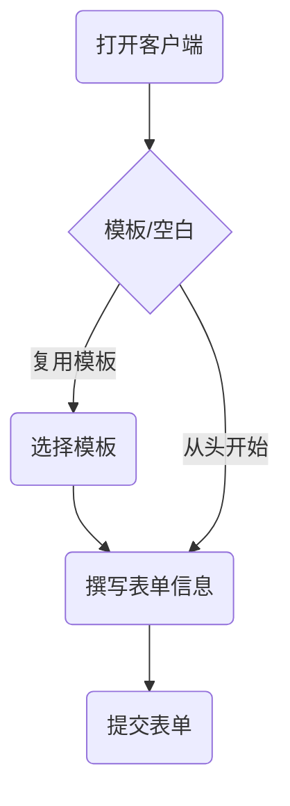
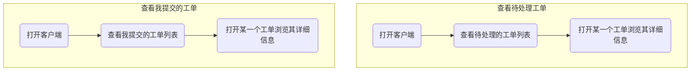

# 提单工具需求分析

- [提单工具需求分析](#提单工具需求分析)
  - [需求列表](#需求列表)
  - [复用反馈模板快速撰写表单并提交到数据库](#复用反馈模板快速撰写表单并提交到数据库)
    - [摘要](#摘要)
    - [业务流程](#业务流程)
    - [用例详情](#用例详情)
      - [用例描述](#用例描述)
      - [用例条件](#用例条件)
  - [将编辑的表单草稿保存在本地方便再次编辑](#将编辑的表单草稿保存在本地方便再次编辑)
    - [摘要](#摘要-1)
    - [业务流程](#业务流程-1)
    - [用例详情](#用例详情-1)
      - [用例描述](#用例描述-1)
      - [用例条件](#用例条件-1)
  - [浏览自己已经提交的工单和待处理的工单](#浏览自己已经提交的工单和待处理的工单)
    - [摘要](#摘要-2)
    - [业务流程](#业务流程-2)
    - [用例详情](#用例详情-2)
      - [用例描述](#用例描述-2)
      - [用例条件](#用例条件-2)

## 需求列表

1. 复用反馈模板快速撰写表单并提交到数据库
2. 将编辑的表单草稿保存在本地方便再次编辑
3. 浏览自己已经提交的工单和待处理的工单

## 复用反馈模板快速撰写表单并提交到数据库

### 摘要

用户登陆系统后复用模板内容进行快速提单

### 业务流程

### 用例详情

#### 用例描述

用户A在客户端复用编辑好的表单模板，编辑完成一条 Bug 反馈工单，点击提交后客户端通过 API 接口将工单提交到后台数据库。

#### 用例条件

1. 网络连接正常
2. 登陆用户账号

## 将编辑的表单草稿保存在本地方便再次编辑

### 摘要

用户将编辑一半的表单保存为草稿，下次打开时可以从草稿箱找到草稿继续编辑。

### 业务流程

### 用例详情

#### 用例描述

用户A打开客户端编辑了一条Bug反馈工单，编辑到一半发现Bug复现步骤有待完善，便将此工单保存到草稿箱，然后继续去复现Bug,复现完成之后，用户A再次打开客户端，打开保存在草稿箱中的工单草稿，继续编辑完成，之后将工单提交到后台数据库。

#### 用例条件

1. 用户登陆到客户端

## 浏览自己已经提交的工单和待处理的工单

### 摘要

查看已存在工单的详细信息并进行简单操作

### 业务流程

### 用例详情

#### 用例描述

用户B将某一工单指派给用户A来解决，用户A查看待处理工单列表，看到有一条新的待处理工单，打开查看工单的详细内容。
#### 用例条件

1. 有人将工单指派给用户